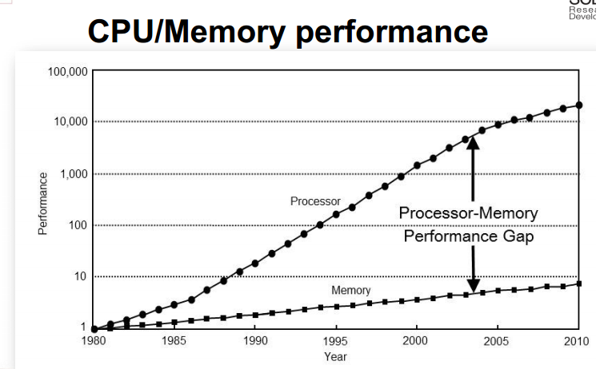
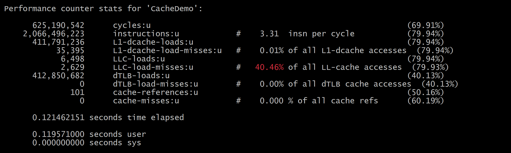
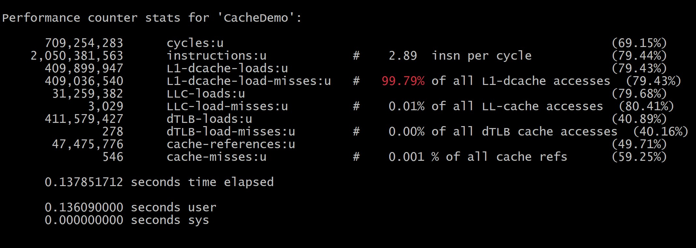
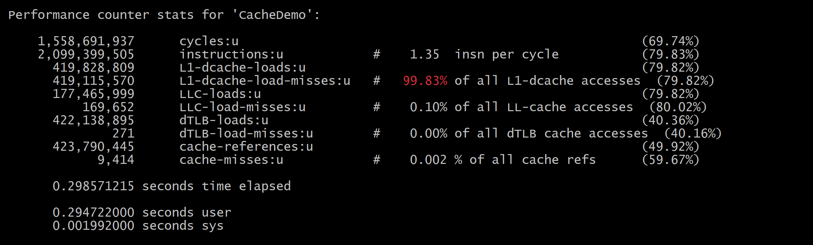
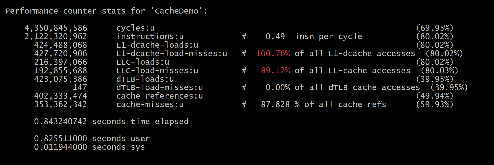
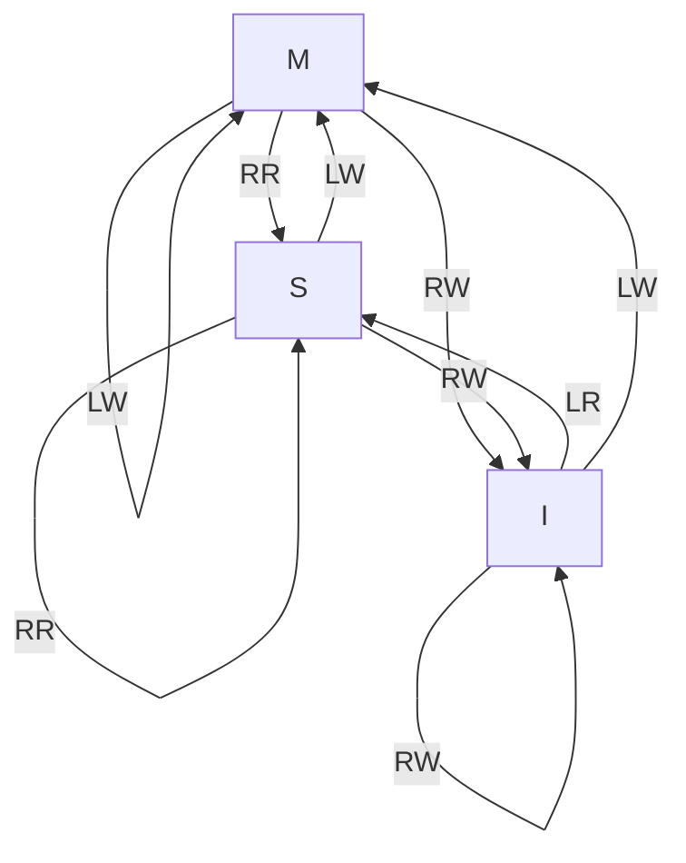

# CSE 398/498 — Impact of the Memory System
## Class Notes

---

## Table of Contents

1. [CPU-Memory Performance Gap](#1-cpu-memory-performance-gap)
2. [The Memory Hierarchy & Caching](#2-the-memory-hierarchy--caching)
   - SRAM
   - L1, L2, L3 Caches
3. [Virtual Memory & TLBs](#3-virtual-memory--tlbs)
4. [The 4 C's of Cache Misses](#4-the-4-cs-of-cache-misses)
5. [Efficient Software Design Paradigms](#5-efficient-software-design-paradigms)
   - Structure of Arrays vs Array of Structures
   - Data-Oriented Design & ECS
6. [Cache Coherence](#6-cache-coherence)
   - MSI Protocol
   - MESI Protocol
   - MOESI Protocol
   - MESIF Protocol
7. [Cache Inclusion Policies](#7-cache-inclusion-policies)
   - Inclusive
   - Exclusive
   - NINE (Non Inclusive – Non Exclusive)

---

## 1. CPU-Memory Performance Gap

### Why Memory Matters

A computer's core consists of the CPU and RAM, connected through the **Memory Bus**. The **CPU-Memory Performance Gap** refers to the disparity between the speed of CPU operations and the speed of memory access.

**Concrete Example:**
- An 800 MHz processor connected to a 100 MHz memory bus
- For every memory access, **8 CPU clock cycles** elapse
- If the CPU is stalling on a memory access, **7 of those 8 cycles are wasted**
- At scale (pipelining, out-of-order execution), the actual slowdown is **much worse than 8×**.



### Solutions to Shrink the Gap

There are several ideas modern processors leverage to reduce the impact of this gap. 

| Solution | Notes |
|---|---|
| **Caching** | Primary focus of this module |
| CPU-Level Parallelism | Doing multiple operations in the CPU in parallel. EX: Pipelining |
| Prefetching | Anticipating future memory accesses |
| Memory-Level Parallelism | Overlapping multiple memory requests |
| **TLBs** | Secondary focus of this module |

> **Key Insight:** The performance gap underpins almost every topic covered in this class. Every optimization technique we discuss is, in some sense, a response to this gap.

---

## 2. The Memory Hierarchy & Caching

### Overview

```
Registers      →  0 – <1 cycles
L1 Cache       →  1 – 5 cycles       | ~192 KB instructions + 128 KB data (per core)
L2 Cache       →  5 – 15 cycles      | 1 – 4 MB (per core)
L3 Cache       →  20 – 60+ cycles    | Varies; shared across cores
Main Memory    →  150+ cycles        | GBs to TBs
Storage (Disk) →  Millions of cycles |
```

> Note: Access times are estimates and vary per machine. Try Using `lscpu` on linux to inspect your machine's cache configuration.

---

### SRAM - The Physical Building Block of CPU Caches

L1, L2, and L3 are all built on **Static Random Access Memory (SRAM)**.

| Property | Details |
|---|---|
| **Speed** | Data readable in just a few CPU cycles - no waiting for intermediate states |
| **Stability** | No refresh required; retains data as long as power is on |
| **Cost & Size** | Physically large (~6 transistors per bit vs. 1 transistor + capacitor for DRAM); expensive |
| **Power** | Consumes more power than DRAM |
| **Bandwidth** | Multi-ported: different SRAM banks can process reads/writes in parallel - critical for cache bandwidth |

**Contrast with DRAM:**
- DRAM: 1 transistor + 1 capacitor per bit → cheaper, denser, but leaks charge and must be **refreshed thousands of times per second**
- SRAM: 6 transistors per bit → fast, stable, but expensive and large

> **Note on NUMA (Non-Uniform Memory Access):** Memory access latency is not uniform across cores. Accessing memory physically local to a core's socket is faster than accessing memory on a remote socket. This becomes important in multi-socket systems.

---

### The L1 Cache

- **Private per core** (each core has its own L1)
- **Split into L1I (Instructions) and L1D (Data)** to avoid contention between instruction fetches and data loads
- **Goal:** Sustain multiple memory operations per cycle with minimal latency so the CPU pipeline does not stall
- **Bandwidth:** Tens to hundreds of GB/s per core
- **Associativity:** Moderate; kept limited to achieve low latency
- **Sensitivity:** Limited associativity → highly sensitive to **conflict misses**
  - Data layout, alignment, and spatial locality matter most at L1

---

### The L2 Cache

- **Private per core**, similar architecture to L1
- Slightly higher latency than L1; still high bandwidth (tens–100 GB/s)
- **Goal:** Catch L1 misses quickly before they reach L3 or DRAM
- Higher capacity → holds a larger working set than L1
- More forgiving associativity than L1
- Conceptually a **"backup" for L1**

---

### The L3 Cache

- **Shared across all cores on the chip**
- Much larger than L2; lower bandwidth (typically 1–10 GB/s)
- Very high associativity
- **Goal:** Avoid DRAM accesses (each DRAM access = 150+ wasted cycles)
- **Key role in cache coherence:**
  - Coherence is coordinated at the L3 level
  - L3 stores **metadata** about which cores have copies of cache lines and their states
  - Cores use L3 to agree upon the state of shared data

---

### Cache Demo

The following program is meant to trigger different levels of cache misses and compare performance.

'''cpp
#include <cstdint>
#include <cstdlib>
#include <cstring>
#include <vector>
#include <algorithm>


static volatile std::uint64_t g_sink = 0;

// Touch one 64B cache line per step (typical cache line size on x86/ARM64).
constexpr std::size_t kLine = 64;
// Reads one byte from each cache line, accumulating into g_sink.
static inline void touch_lines(const std::uint8_t* data, std::size_t bytes) {
    std::uint64_t sum = 0;
    for (std::size_t i = 0; i < bytes; i += kLine) {
        sum += data[i];
    }
    g_sink += sum;
}


void hit_L1(std::size_t iters = 1600000) {
    const std::size_t bytes = 16 * 1024; // 16KB
    std::uint8_t* buf = static_cast<std::uint8_t*>(
        std::aligned_alloc(64, bytes)
    );
    std::memset(buf, 1, bytes);

    // Warm once.
    touch_lines(buf, bytes);

    for (std::size_t t = 0; t < iters; ++t) {
        touch_lines(buf, bytes);
    }
    std::free(buf);
}

void miss_L1_hit_L2(std::size_t iters = 100000) {
    const std::size_t bytes = 256 * 1024; // 256KB
    std::uint8_t* buf = static_cast<std::uint8_t*>(
        std::aligned_alloc(64, bytes)
    );
    std::memset(buf, 2, bytes);

    // Warm once.
    touch_lines(buf, bytes);

    for (std::size_t t = 0; t < iters; ++t) {
        touch_lines(buf, bytes);
    }
    std::free(buf);

}


void miss_L2_hit_L3(std::size_t iters = 3200) {
    const std::size_t bytes = 8 * 1024 * 1024; // 8MB
    std::uint8_t* buf = static_cast<std::uint8_t*>(
        std::aligned_alloc(64, bytes)
    );
    std::memset(buf, 3, bytes);

    // Warm once.
    touch_lines(buf, bytes);


    for (std::size_t t = 0; t < iters; ++t) {
        touch_lines(buf, bytes);
    }
    std::free(buf);

}


void miss_L3_go_DRAM(std::size_t iters = 100) {
    const std::size_t bytes = 256ULL * 1024 * 1024; // 256MB
    std::uint8_t* buf = static_cast<std::uint8_t*>(
        std::aligned_alloc(64, bytes)
    );
    if (!buf) return;
    std::memset(buf, 4, bytes);

    // Warm once.
    touch_lines(buf, bytes);

    // Repeated passes: should be dominated by DRAM/LLC misses.
    for (std::size_t t = 0; t < iters; ++t) {
        touch_lines(buf, bytes);
    }
    std::free(buf);
}


/*
g++ -O3 -std=c++17 CacheDemo.cpp -o CacheDemo 
perf stat -e cycles,instructions,L1-dcache-loads,L1-dcache-load-misses,LLC-loads,LLC-load-misses,dTLB-loads,dTLB-load-misses,cache-references,cache-misses CacheDemo
 */
int main() {
    //hit_L1();
    //miss_L1_hit_L2();
    //miss_L2_hit_L3();
    miss_L3_go_DRAM();
    return (int)g_sink;
}

'''

The results:
| Cache Level | Details |
|---|---|
|Hit L1| |
|Miss L1||
|Miss L2||
|Miss L3||


## 3. Virtual Memory & TLBs

### Why Virtualize Memory Addresses?

| Problem | Description |
|---|---|
| **Memory Management** | Programs would need to know the physical layout; data overwriting becomes dangerous |
| **Fragmentation** | Programs struggle to load contiguously in physical memory |
| **Security & Isolation** | Without virtualization, any program can read/write any physical address — OS and other programs are unprotected |
| **Multitasking** | Each program assumes it starts at address 0; simultaneous execution of multiple programs becomes impossible |

### Address Translation

Virtual addresses are translated to physical addresses through a **page table** (typically a multi-level tree structure).

- On modern 64-bit systems (48-bit effective virtual address space), a **5-level page table** is common
- The Virtual Page Number (VPN) is split into multiple parts — one per level of the page table
- Each level lookup is a memory access, making a full page table walk expensive

**Why split the VPN into multiple parts?**
- A flat (single-level) page table for a 64-bit address space would be enormous
- The multi-level tree is sparse: only allocate entries for pages that are actually used
- Tradeoff: Saves space but adds search latency and complexity

### TLBs (Translation Lookaside Buffers)

A **TLB is a cache of page table entries**. It stores recently used virtual→physical address translations.

**TLB Miss Penalty — "Double Punishment":**

1. **Increased absolute access latency:** Must traverse the in-memory page table tree (multiple memory accesses) to re-translate the address
2. **Pipeline disruption:** Out-of-order execution cannot proceed until the translation completes; the pipeline stalls

**TLB Misses vs. Cache Misses — Orthogonal or Amplifier?**
- They are somewhat **orthogonal**: a TLB hit doesn't prevent a cache miss, and vice versa
- But they can **amplify** each other: code with poor spatial locality causes both TLB misses (accessing many pages) and cache misses simultaneously

**Huge Pages:**
- Mapping larger regions per page table entry reduces TLB pressure
- Fewer TLB entries needed to cover the same working set

**Code Example — Matrix Multiplication:**
- A naive matrix access pattern (column-major access of a row-major matrix) causes high TLB miss rates
- Blocking (tiling) the matrix improves both TLB utilization and cache utilization simultaneously

---

## 4. The 4 C's of Cache Misses

| Miss Type | Definition | Can a Larger/Better Cache Eliminate It? |
|---|---|---|
| **Compulsory** (Cold) | First access ever to a cache line. Unavoidable. | No |
| **Capacity** | Cache doesn't have enough room to hold the working set. | Yes — with a larger cache |
| **Conflict** | Two addresses map to the same cache set; one evicts the other even though capacity exists. | Yes — with higher associativity |
| **Coherence** | A valid cache line is invalidated due to a write by another core. | No — inherent in multicore systems |

### Compulsory Miss
- The inevitable "first access" cost
- No matter how perfectly the cache is designed, the first access to any new data will miss
- Prefetching can help hide (but not eliminate) compulsory misses

### Capacity vs. Conflict Miss — Distinguishing Them

> **Key diagnostic question:** If you converted the cache to a fully associative cache with the same total capacity, would this access still miss?
> - **Yes** → Capacity miss
> - **No** → Conflict miss (the set was full, not the whole cache)

**Example — Direct-Mapped Cache, Capacity 4:**
```
Access pattern: A B A B C D C D

Direct-Mapped (DM):
  A → miss (cold)
  B → miss (cold)
  A → miss (CONFLICT — A and B map to same set)
  B → miss (CONFLICT)
  C → miss (cold)
  D → miss (cold)
  C → miss (CONFLICT)
  D → miss (CONFLICT)

Fully Associative (FA), same capacity:
  A → miss (cold)
  B → miss (cold)
  A → HIT
  B → HIT
  C → miss (cold)
  D → miss (cold)
  C → HIT
  D → HIT
```

**Another example — Capacity miss:**
```
Access pattern: A B C D E A B C D E  (cache capacity = 4)

FA cache misses on second A even though it's fully associative → Capacity miss
```

> **Programmer's question:** Can you do anything to distinguish capacity vs. conflict misses at the code level?
> - Vary data structure size/alignment to shift mapping patterns
> - Use performance counters (`perf`) to observe LLC miss rates at different data sizes

---

## 5. Efficient Software Design Paradigms

### The Problem: OOP Doesn't Always Fit High-Performance Code

Object-Oriented Programming designs types around **a single object**. High-performance code cares about **how many objects are processed in the same loop** and whether their data is contiguous in memory.

---

### Structure of Arrays (SoA) vs. Array of Structures (AoS)

**Scenario:** Design a CPU-side particle system (thousands of particles per frame). Each particle has: `position (Vec3)`, `velocity (Vec3)`, `mass (float)`.

**Array of Structures (AoS) — naive OOP approach:**
```cpp
struct Particle {
    Vec3 position;
    Vec3 velocity;
    float mass;
};
Particle particles[N];
```

**Problem with AoS for a velocity-update loop (e.g., simulating an explosion):**
- Loop only touches `velocity` fields
- But cache lines load the entire `Particle` struct, including `position` and `mass`
- **High stride**: the stride between `velocity` fields = `sizeof(Particle)`
- Most of each cache line is wasted → poor cache utilization

**Structure of Arrays (SoA) — data-oriented approach:**
```cpp
struct ParticleSystem {
    Vec3 positions[N];
    Vec3 velocities[N];
    float masses[N];
};
```

- Velocity-update loop reads `velocities` array sequentially → stride = `sizeof(Vec3)`
- **Cache lines are fully utilized** — no wasted fields loaded

> **Professor's Note:** SoA is great for performance, but harder to use naturally in OOP. Optimization can become a mess with hard-to-follow code — ECS is a paradigm designed to manage this complexity.

---

### Data-Oriented Design (DOD)

- Prioritizes **data layout and access patterns** over object encapsulation
- Somewhat incompatible with OOP by design (per Wikipedia)
- Emerged from game development; now used in HFT, scientific simulation, big data processing

---

### Entity Component System (ECS)

ECS is a programming paradigm that replaces OOP in pursuit of **composable behavior and maximum control over data layout**.

**Three core concepts:**

| Concept | Definition |
|---|---|
| **Entity** | Just a unique ID (UID). Represents a "thing" in the system. Has no data or behavior of its own. |
| **Component** | A plain struct of data. Gets fed into Systems as input. |
| **System** | Operates on Components, not Entities. Any entity possessing the required component set automatically participates in the system. |

**Key insight:** ECS naturally expresses all entities as **Structs of Arrays**, grouped by component type → extremely efficient cache usage at the paradigm level.

**Advantages over OOP inheritance:**
- Avoids deep inheritance hierarchies (composition over inheritance)
- Behavior is entirely determined by which components an entity owns
- Easy to add/remove behaviors without changing class hierarchies

**Applications:**
- Video game engines (Unity DOTS, Bevy, etc.)
- High-frequency trading systems
- Scientific simulations
- Big data processing

---

## 6. Cache Coherence

### Motivation

In a multicore system, multiple cores each have their own private L1 and L2 caches. If two cores cache the same memory location and one writes to it, the other core's copy becomes stale. **Cache coherence** protocols ensure all cores have a consistent view of memory.

**Two fundamental requirements:**

| Requirement | Definition |
|---|---|
| **Write Propagation** | A write by one core must eventually be visible to all other cores |
| **Write Serialization** | All cores must agree on the **global total order** of writes to the same memory location |

> **Important distinction:**
> - **Coherence** = global total order on stores to a **single cache line**
> - **Consistency** = ordering across **multiple cache lines** (a broader, harder problem)
> - A globally totally ordered set of stores does NOT mean the program is race-free — it just bounds how dangerous a race can be
> - Read-read sharing is always safe; coherence only concerns stores

> **Snooping vs. Directory Protocols:**
> - **Snooping:** Every cache monitors a shared bus for coherence messages. Simple but doesn't scale well.
> - **Directory:** A centralized directory tracks which caches hold which lines. More scalable; doesn't require all caches to snoop the bus.

---

### MSI Protocol

Three states for each cache line, per cache:

| State | Meaning |
|---|---|
| **M (Modified)** | This is the **only valid and most recent copy**. You have exclusive write rights. Changes have NOT been written back to main memory. |
| **S (Shared)** | Copy is valid and up-to-date, but **other caches may hold identical copies**. Read-only; no exclusive rights. |
| **I (Invalid)** | This copy is **invalid and cannot be trusted**. Must fetch a fresh copy before use. |

#### MSI State Transition Table

| Current State | Event | Next State | Action |
|---|---|---|---|
| M | Local Read (LR) | M | — |
| M | Local Write (LW) | M | — |
| M | Remote Read (RR) | S | Supply data; writeback to memory |
| M | Remote Write (RW) | I | Invalidate |
| S | Local Read (LR) | S | — |
| S | Local Write (LW) | M | Broadcast invalidation to other sharers |
| S | Remote Read (RR) | S | — |
| S | Remote Write (RW) | I | Invalidate |
| I | Local Read (LR) | S | Fetch from memory or another cache |
| I | Local Write (LW) | M | Fetch and take exclusive ownership |
| I | Remote Read (RR) | I | — |
| I | Remote Write (RW) | I | — |

**Abbreviations:**
- LR = Local Read
- LW = Local Write
- RR = Remote Read (another core accessed this line)
- RW = Remote Write (another core wrote this line)



> **Professor's Note (Spear):** It may help to first think about a two-state non-concurrent protocol (Valid/Invalid), then motivate why a Shared state is needed.

**Important edge cases:**
- What happens when a line in **M** is evicted for capacity/conflict? → Must write back to main memory before eviction
- What about evicting for coherence? → Same; must writeback
- Where do coherence messages go, and how far do they travel?
- Think about **responses** to bus messages too (not just requests)

---

### MESI Protocol

MESI adds the **Exclusive (E)** state to MSI.

| State | Meaning |
|---|---|
| M | Modified — only valid copy, dirty (differs from main memory) |
| **E (Exclusive)** | **Only clean copy** — identical to main memory, but no other cache has a copy |
| S | Shared — valid, clean, but other caches may also have it |
| I | Invalid |

**Why E improves over MSI:**

In MSI, when you have the only copy of a clean line, it's in **S** — but the system doesn't know it's the only copy. To write to it, you must broadcast an invalidation to all potential sharers (even though there are none).

With E, the system knows explicitly: "this is the only copy, and it's clean." An **E→M transition** is silent — no invalidation broadcast needed.

> **Prof. Spear:** The E→M transition is really cheap. There's a subtlety here: without E, you can have a **slowdown on a write that isn't even a cache miss** — you're just waiting for an ACK to an unnecessary invalidation broadcast. E eliminates that.

> **Subtle point:** An S-state line might effectively be the only copy (other caches may have silently evicted it for capacity), but the system doesn't know that — so it's treated as S, not E. This is a "silent E" situation.

---

### MOESI Protocol

MOESI adds the **Owned (O)** state to MESI.

**Problem MOESI solves:**
When Core B reads a line that Core A has in **M**, Core A must write back the dirty data to main memory before Core B can read it from memory. This incurs:
- **Write latency** (Core A must writeback)
- **Read latency** (Core B must then read from main memory)

**O (Owned) state:**
- Dirty data, but **not the only copy**
- Other caches may hold S-state copies, but their data comes from the O-holder
- The O-holder is **responsible for writing back to main memory** eventually
- The O-holder can **supply data directly to requesting caches** (Direct Cache-to-Cache Transfer), bypassing main memory

| Property | O state |
|---|---|
| Valid? | Yes |
| Matches main memory? | No (dirty) |
| Only copy? | No — other caches have S-state copies |
| Can serve read requests? | Yes, directly |
| Must writeback before eviction? | Yes |

> **Prof. Spear:** This is a write-back cache behavior (as opposed to write-through). Worth understanding write-back vs. write-through before diving into MOESI.

> **Eviction problem with O:** If the O-holder wants to evict the line (LRU), it must write back to memory first. This raises a question: do we prioritize keeping O lines in cache even if they're LRU candidates? What if the core is genuinely done using the line?

---

### MESIF Protocol

MESIF adds the **Forward (F)** state to MESI.

**Problem MESIF solves:**
When multiple cores hold a line in **S** and a new core requests a read, who responds?
- All S-holders? → Wasteful, causes bus contention
- Random selection? → Unpredictable
- Memory always responds? → Slow

**F (Forward) state:**
- Clean data, multiple copies exist (other caches are in S)
- Exactly **one cache** is designated as F — it is responsible for **forwarding** data to new requesters
- The F-holder responds to read requests directly, rather than memory

**F state transitions:**
- When the F-holder forwards data, the receiver becomes the new F-holder (E→F, F→S, receiver→F)
- Why? **Temporal locality**: the most recent requester is most likely to be needed next

> **Prof. Spear:** The F state decision (which S becomes F) exploits temporal locality — the core that most recently received data is the best forwarder.

---

### Summary: MSI → MESI → MOESI → MESIF

| Protocol | Added State | Problem Solved |
|---|---|---|
| MSI | — | Baseline coherence |
| MESI | Exclusive (E) | Eliminates unnecessary invalidation broadcasts for single-copy writes |
| MOESI | Owned (O) | Enables direct cache-to-cache transfer of dirty data |
| MESIF | Forward (F) | Designates a single forwarder among S-state caches to reduce memory traffic |

---

### Coherence Miss (Detailed)

**Scenario:**
1. Core A and Core B both cache data X → both in **S**
2. Core A writes to X → Core A transitions to **M**, broadcasts **invalidation** to Core B
3. Core B's copy is marked **I (Invalid)**
4. Core B later reads X → **Cache miss** (coherence miss) → must fetch updated value from Core A or main memory

This is the fourth "C" miss — unavoidable in shared-memory multicore systems.

---

### Key Open Questions on Coherence

- **Verification is extremely hard**: Coherence protocols have subtle bugs; transient states (e.g., receiving a remote write while transitioning states) are notoriously difficult to handle correctly
- **Transient states**: What happens if a remote write arrives while a cache is in the middle of transitioning? These transient states must be handled without blocking other threads
- **How do hierarchical caches affect coherence?** Inclusive vs. exclusive policies have significant implications (see next section)
- **LRU interactions**: Do M/O/F state lines affect LRU decisions? (You might avoid evicting an O line to avoid a writeback, but what if you're genuinely done?)
- **NUMA implications**: In NUMA systems, "main memory" for one core is further away than for another. How does coherence interact with non-uniform memory latency?
- **Scalability**: Snooping doesn't scale well to many cores; directory protocols are needed at scale

---

## 7. Cache Inclusion Policies

### Overview

Multi-level caches must decide: if a line is in L1, does it also exist in L2 and L3?

| Policy | Description |
|---|---|
| **Inclusive** | All blocks in a higher-level cache (L1) are also present in the lower-level cache (L3) |
| **Exclusive** | A block exists in exactly one level at a time |
| **NINE** | Neither Inclusive Nor Exclusive — adaptive/nondeterministic |

---

### Inclusive Policy

**Definition:** If a line is in L1, it is also in L2 (and L3). Lower levels are supersets of higher levels.

**Advantages:**
- **Cheap refills:** When bringing a line back to L1, it must already be in L2/L3 — no need to fetch from DRAM
- **L3 as coherence directory:** L3 always knows which lines are in which L1 caches → coherence lookups stop at L3, never need to broadcast to all L1s

**Disadvantages:**
- **Back invalidations (biggest issue):** When L3 evicts a line for capacity or coherence, it must also invalidate the copy in L1/L2. This causes unexpected L1 misses.
  - L3 invalidations triggered by: remote core coherence events, L2 invalidations from L1 i-cache, or differing replacement policies
- **Wasted capacity:** Every line in L1 also occupies a slot in L3. With many cores sharing L3, this capacity waste scales linearly with core count
- **Associativity constraints:** L3's associativity policy must accommodate L1 contents

> **Why would we evict from L2 before L1 in an inclusive cache?**
> - L3 can trigger an invalidation of a line that is hot in L1 (e.g., because L3's LRU thinks it's cold — but L3 doesn't receive L1 hit signals)
> - Differing replacement policies between L1 and L3 can cause this mismatch

---

### Exclusive Policy

**Definition:** A line exists in at most one cache level at a time. On an L1 miss, the line moves from L2 to L1 (evicted from L2).

**Advantages:**
- **Maximum effective capacity:** No duplication across levels — total cache capacity = sum of all levels
- **No back invalidations:** L3 evictions don't invalidate L1 lines
- **Better multicore scaling** than inclusive (L3 capacity isn't wasted on duplicates)

**Disadvantages:**
- **Poor coherence support:** L3 no longer acts as a directory — a core must check all other cores' private caches to find a line
- **Forces uniform cache line size across all levels:** Suboptimal; different levels may benefit from different line sizes
- **Data transfer on eviction of S-state data:** Evicting a shared line from L1 requires moving it down to L2
- **Costlier snooping** due to lack of directory

---

### NINE: Non Inclusive – Non Exclusive

**What modern CPUs actually use:**
- Intel moved away from strictly inclusive LLC ~2015 (Skylake)
- AMD moved away from strictly exclusive LLC ~2017 (Zen)

**How NINE works:**
- NINE is NOT simply "fetch inclusively, evict independently"
- NINE makes decisions based on **microarchitectural state**: recent access history, prefetch hints, coherence hints, etc.
- **Nondeterministic:** A fetch to L1 may result in any combination of L2 and L3 caching the block — the outcome depends on internal microarchitectural state that software cannot observe
- More complex but more powerful — allows the CPU to optimize for the observed workload dynamically

> **Prof. Spear:** The nondeterminism of NINE is real — when Intel went inclusive and AMD went exclusive, both found that strict policies were leaving performance on the table. NINE gives the hardware freedom to adapt.

---

## Appendix: Professor's Additional Notes (from course feedback emails)

### On Particle Systems and SoA
- High stride through AoS layout causes non-stop cache line fetches when only one field per struct is needed
- ECS is a "nice way to work with this" — avoids deep OOP hierarchies; composition over inheritance

### On Cache Coherence Protocol Presentation
- Worth defining what "coherence" actually means before the protocols
- Start with a two-state (Valid/Invalid) non-concurrent protocol, then motivate why S is needed
- **Emphasis on global total order:** Coherence = global total order on stores to a single cache line; does not mean the program is race-free
- The "single cache line, single cache, four possible events" formulation is a useful alternative to flowcharts
- Where does dirty (M-state) data go on capacity/conflict eviction? On coherence eviction?
- Think about NUMA: how does physical memory distance affect coherence message latency?

### On Cache Miss Taxonomy
- LLC misses during warmup are **compulsory** — not a big deal (few, and unavoidable)
- IPC drops sharply and proportionally when L2/L3 miss rates increase → use `perf` to measure
- Can a programmer distinguish capacity vs. conflict misses at the code level? (Open question — varies data layout/alignment to shift mapping)

### On TLBs
- TLB is a cache of page table entries — miss cost = traversal through the in-memory page table tree
- TLB misses and cache misses: more amplifier than orthogonal (poor spatial locality → both)
- Huge page support reduces TLB pressure; worth understanding why

### On Inclusive vs. Exclusive Caches
- Why L2 might evict before L1 in an inclusive system:
  - L3 invalidations from remote cores
  - L2 invalidations from L1 i-cache
  - Differing replacement policies (L1 hit signals don't propagate to L3's LRU)
- Exclusive: extra data transfer cost when evicting S-state lines; uniform line size requirement
- NINE: nondeterministic behavior — Intel went inclusive pre-2015, AMD exclusive pre-2017, both switched to adaptive

### On MESI
- E→M transition is "really cheap" — avoids broadcast; no bus ACK needed
- A wait-for-ACK on a write (without E) is a subtle slowdown that is NOT a cache miss — MESI's E state eliminates it
- **Dirty data propagation:** Can a line be M at L3 while S in all L1s? (Important for hierarchical coherence understanding)

### On MOESI
- Defers writeback of dirty lines — enables direct cache-to-cache transfer
- Implies **write-back** cache (not write-through)
- Problem: Do we avoid evicting O lines even when LRU? What if we're genuinely done with the data?

### On MESIF
- The F-holder decision exploits temporal locality — most recent requester is most likely to forward next
- Transfer of F responsibility: E→F, F→S, receiver becomes new F

---

*Notes compiled from course slides (CSE 398/498 — Impact of the Memory System) and instructor feedback emails (Prof. Michael Spear, Lehigh University).*
